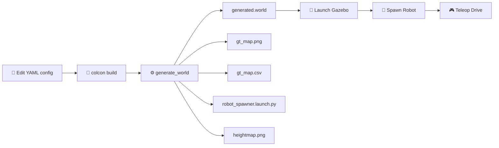
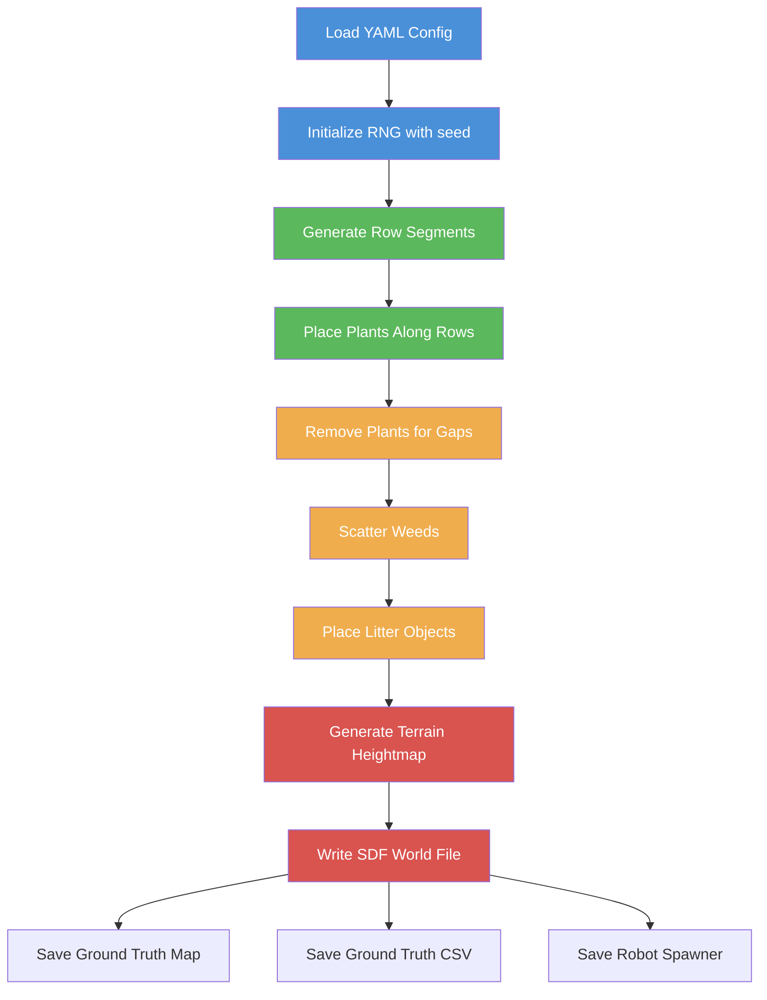
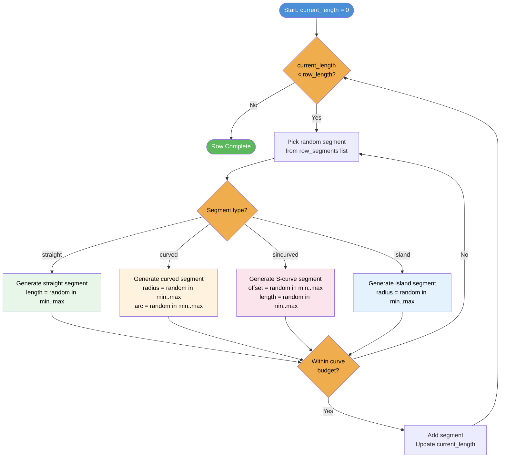
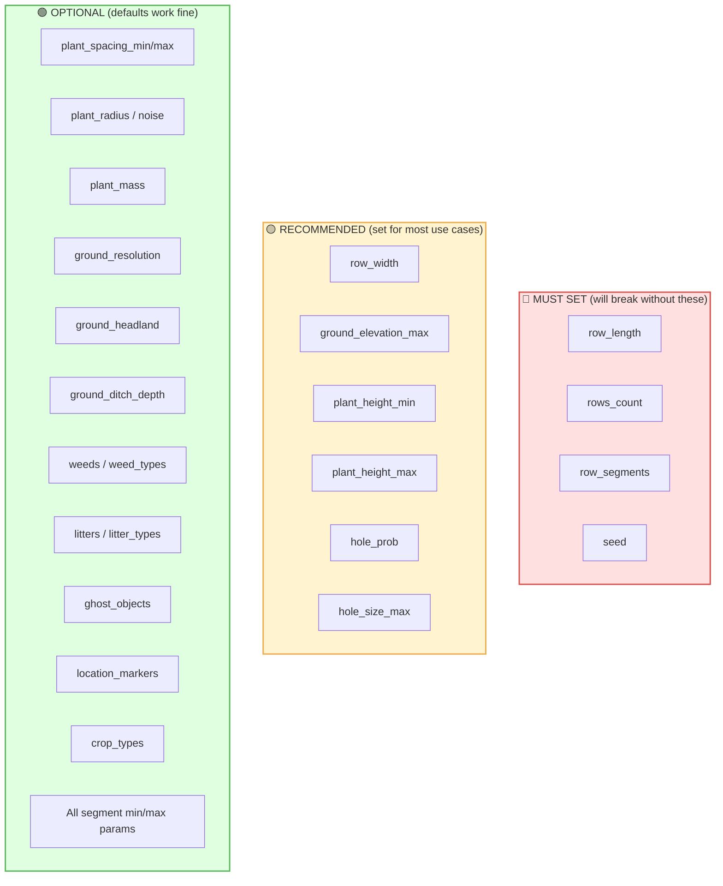
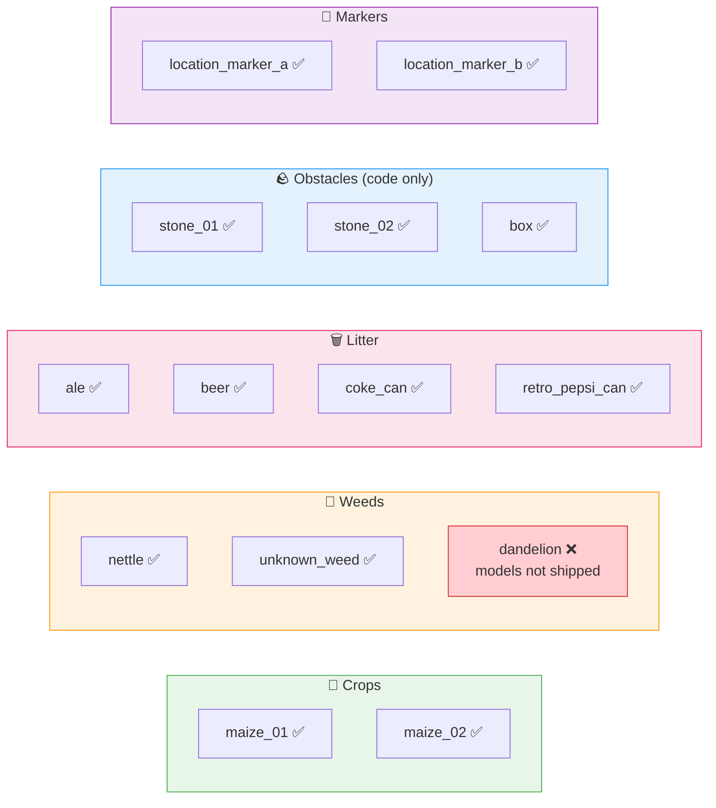
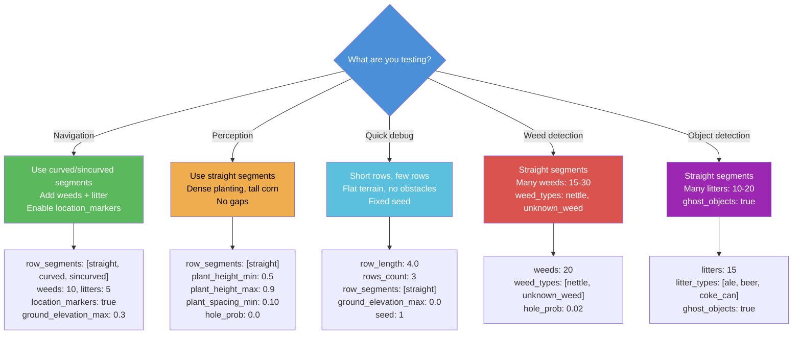
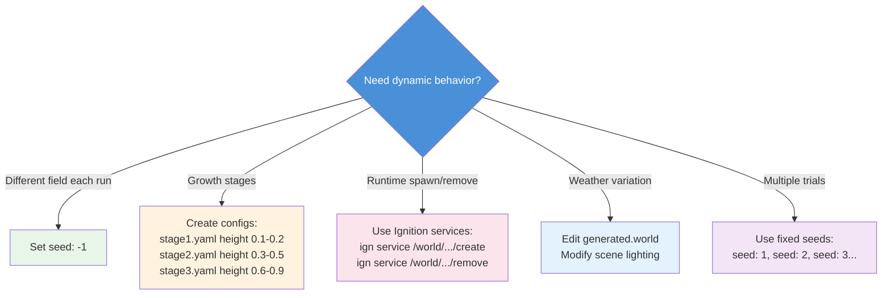

# Field Generator Flowcharts

## 1. Overall Workflow

## 2. World Generation Pipeline

## 3. Row Segment Generation

## 4. Parameter Priority Map

## 5. Available 3D Models

## 6. Config Decision Tree

## 7. Dynamic Fields — Workarounds

